# APIs e Web Services

O planejamento de uma aplicação de APIs Web é uma etapa fundamental para o sucesso do projeto. Ao planejar adequadamente, você pode evitar muitos problemas e garantir que a sua API seja segura, escalável e eficiente.

A API do sistema **Habitare – Gestão de Condomínios** será responsável por viabilizar a comunicação entre os módulos do sistema distribuído, garantindo que as informações fluam corretamente entre moradores, administradores, porteiros e demais usuários. Ela também permitirá futuras integrações com sistemas externos, como serviços de notificação, plataformas de pagamento e sistemas de controle de acesso.

## Objetivos da API

### Objetivo Geral
Desenvolver uma API RESTful para permitir a comunicação entre os módulos do sistema Habitare, de forma segura, escalável e eficiente.

### Objetivos Específicos
- Fornecer endpoints para gerenciamento de usuários (moradores, síndicos, administradores, porteiros).
- Permitir a criação, consulta, atualização e cancelamento de reservas de áreas comuns.
- Gerenciar o registro e o acompanhamento de ocorrências condominiais.
- Prover um canal de comunicação assíncrono entre os moradores.
- Garantir autenticação e autorização de usuários utilizando padrões JWT.


## Modelagem da Aplicação

### Entidades

O modelo de dados é composto por cinco entidades principais que representam a gestão de um condomínio:

1. **Usuários (users)**: Representa os usuários do sistema, que podem ser administradores ou moradores.
2. **Ocorrências (ocorrencias)**: Registra situações ou eventos que precisam ser documentados, como problemas ou incidentes.
3. **Reservas (reservas)**: Gerencia as reservas de espaços ou serviços disponíveis, como salões de festas ou áreas comuns.
4. **Visitantes (visitantes)**: Armazena informações sobre os visitantes que entram no condomínio.
5. **Moradores (moradores)**: Contém dados dos moradores do condomínio, como seus apartamentos e informações de contato.


## Tecnologias Utilizadas

- **Node.js**: Plataforma para execução do JavaScript no servidor, oferecendo alta performance e grande ecossistema de bibliotecas.
- **Express.js**: Framework web minimalista para Node.js, ideal para criação de APIs RESTful.
- **JWT (JSON Web Token)**: Para autenticação segura baseada em tokens.
- **Sequelize ORM**: Para abstração e manipulação de bancos de dados relacionais com JavaScript.
- **RESTful API**: Arquitetura de API baseada em recursos e métodos HTTP (GET, POST, PUT, DELETE).
- **MySQL**: Banco de dados relacional utilizado para armazenar de forma estruturada os dados manipulados pela API.

## API Endpoints

### Endpoints do Serviço de Ocorrências
### Endpoint 1: Criar Ocorrências (usuário)
- Método: POST
- URL: /api/ocorrencias
- Parâmetros:
  - titulo (string): Título da ocorrência. (Obrigatório)
  - descricao (string): Descrição detalhada da ocorrência. (Obrigatório)
- Resposta:
  - Sucesso (201 Created)
    ```
    {
      "id": 1,
      "titulo": "Título da ocorrência",
      "descricao": "Descrição da ocorrência",
      "status": "aberto",
      "userId": 123,
      "createdAt": "2025-04-01T00:00:00.000Z",
      "updatedAt": "2025-04-01T00:00:00.000Z"
    }
    ```

### Endpoint 2: Listar Todas as Ocorrências (admin)
- Método: GET
- URL: /api/listar/ocorrencias
- Parâmetros: Nenhum.
- Resposta:
  - Sucesso (200 OK)
    ```
    [
      {
        "id": 1,
        "titulo": "Título 1",
        "descricao": "Descrição 1",
        "status": "aberto",
        "userId": 123,
        "User": {
          "id": 123,
          "name": "Nome do Usuário",
          "email": "email@example.com"
        }
      },
      ...
    ]
    ```

### Endpoint 3: Listar Ocorrências do Usuário Autenticado
- Método: GET
- URL: /api/ocorrencias
- Parâmetros: Nenhum.
- Resposta:
  - Sucesso (200 OK)
    ```
    [
      {
        "id": 1,
        "titulo": "Título 1",
        "descricao": "Descrição 1",
        "status": "aberto",
        "userId": 123
      },
      ...
    ]
    ```

### Endpoint 4: Obter Detalhes de uma Ocorrência
- Método: GET
- URL: /api/ocorrencias/:id
- Parâmetros:
  - id (path): ID da ocorrência. (Obrigatório)
- Resposta:
  - Sucesso (200 OK)
    ```
    {
      "id": 1,
      "titulo": "Título da ocorrência",
      "descricao": "Descrição da ocorrência",
      "status": "aberto",
      "userId": 123
    }
    ```
  - Erro (404 Not Found)
    ```
    {
      "message": "Ocorrência não encontrada"
    }
    ```

### Endpoint 5: Atualizar Ocorrência
- Método: PUT
- URL: /api/ocorrencias/:id
- Parâmetros:
  - id (path): ID da ocorrência. (Obrigatório)
- Body:
  - titulo (string): Novo título da ocorrência. (Obrigatório)
  - descricao (string): Nova descrição da ocorrência. (Obrigatório)
- Resposta:
  - Sucesso (200 OK)
    ```
    {
      "id": 1,
      "titulo": "Novo título",
      "descricao": "Nova descrição",
      "status": "aberto",
      "userId": 123
    }
    ```
  - Erro (403 Forbidden)
    ```
    {
      "message": "Ocorrência não está aberta para alteração."
    }
    ```

### Endpoint 6: Atualizar Status da Ocorrência (admin)
- Método: PUT
- URL: /api/ocorrencias/status/:id
- Parâmetros:
  - id (path): ID da ocorrência. (Obrigatório)
- Body:
  - status (string): Novo status da ocorrência. (Obrigatório)
- Resposta:
  - Sucesso (200 OK)
    ```
    {
      "id": 1,
      "titulo": "Título da ocorrência",
      "descricao": "Descrição da ocorrência",
      "status": "em analise",
      "userId": 123
    }
    ```

### Endpoint 7: Deletar Ocorrência
- Método: DELETE
- URL: /api/ocorrencias/:id
- Parâmetros:
  - id (path): ID da ocorrência. (Obrigatório)
- Resposta:
  - Sucesso (200 OK): Sem corpo de resposta.
  - Erro (404 Not Found)
    ```
    {
      "message": "Ocorrência não encontrada"
    }
    ```

### Endpoints do Serviço de Reservas

### Endpoint 1: Criar Reserva (usuário)
- Método: POST
- URL: /api/reserva
- Autenticação: Token do usuário (`verifyToken`)
- Parâmetros (Body):
  - `data` (string, formato ISO 8601): Data da reserva. **Obrigatório**
  - `horaInicio` (string, formato HH:mm): Hora de início da reserva. **Obrigatório**
  - `horaFim` (string, formato HH:mm): Hora de término da reserva. **Obrigatório**
  - `descricao` (string): Descrição opcional da reserva.
- Resposta:
  - Sucesso (201 Created)
    ```
    {
      "id": 1,
      "data": "2024-04-10",
      "horaInicio": "14:00",
      "horaFim": "16:00",
      "descricao": "Reserva da sala de reunião",
      "status": "pendente",
      "userId": 123,
      "createdAt": "2024-04-01T00:00:00.000Z",
      "updatedAt": "2024-04-01T00:00:00.000Z"
    }
    ```

### Endpoint 2: Listar Todas as Reservas (admin)
- Método: GET
- URL: /api/reservas
- Autenticação: Token do administrador (`verifyToken` + `isAdmin`)
- Resposta:
  - Sucesso (200 OK)
    ```
    [
      {
        "id": 1,
        "data": "2024-04-10",
        "horaInicio": "14:00",
        "horaFim": "16:00",
        "descricao": "Reserva da sala de reunião",
        "status": "pendente",
        "userId": 123,
        "User": {
          "id": 123,
          "name": "Nome do Usuário",
          "email": "email@example.com"
        }
      }
    ]
    ```

### Endpoint 3: Obter Detalhes de uma Reserva
- Método: GET
- URL: /api/reservas/:id
- Autenticação: Token do usuário (`verifyToken`)
- Parâmetros:
  - `id` (path): ID da reserva. **Obrigatório**
- Resposta:
  - Sucesso (200 OK)
    ```
    {
      "id": 1,
      "name": "Salão de Festas",
      "data": "2024-04-10",
      "horaInicio": "14:00",
      "horaFim": "16:00",
      "status": "Ativo",
      "userId": 123
    }
    ```
  - Erro (404 Not Found)
    ```
    {
      "message": "Reserva não encontrada"
    }
    ```

### Endpoint 4: Atualizar Reserva
- Método: PUT
- URL: /api/reserva/:id
- Autenticação: Token do usuário (`verifyToken`)
- Parâmetros:
  - `id` (path): ID da reserva. **Obrigatório**
- Body:
  - `data`, `horaInicio`, `horaFim`, `descricao`: Novos dados da reserva. **Obrigatório**
- Condições:
  - Apenas reservas com status **"pendente"** podem ser alteradas pelo usuário que criou.
- Resposta:
  - Sucesso (200 OK)
    ```
    {
      "id": 1,
      "data": "2024-04-12",
      "horaInicio": "10:00",
      "horaFim": "12:00",
      "descricao": "Reserva alterada",
      "status": "ativo",
      "userId": 123
    }
    ```
  - Erro (403 Forbidden)
    ```
    {
      "message": "Reserva não está pendente para alteração."
    }
    ```

### Endpoint 5: Cancelar Reserva
- Método: DELETE
- URL: /api/reserva/:id
- Autenticação: Token do usuário (`verifyToken`)
- Parâmetros:
  - `id` (path): ID da reserva. **Obrigatório**
- Resposta:
  - Sucesso (200 OK)
    ```
    {
      "id": 1,
      "nome": "Salão de Festas",
      "data": "2024-04-05",
      "horario": "14:00",
      "status": "cancelado",
      "userId": 123
    }
    ```
  - Erro (403 Forbidden)
    ```
    {
      "message": "Você não tem permissão para cancelar esta reserva."
    }
    ```

### Endpoint 6: Histórico de Reservas do Usuário
- Método: GET
- URL: /api/reservas/historico
- Autenticação: Token do usuário (`verifyToken`)
- Resposta:
  - Sucesso (200 OK)
    ```
    [
      {
        "id": 1,
        "nome": "Salão de Festas",
        "data": "2024-04-05",
        "horario": "14:00",
        "userId": 123
      }
    ]
    ```
  - Erro (404 Not Found)
    ```
    {
      "message": "Nenhuma reserva encontrada"
    }
    ```
    
### Endpoints do Serviço de Moradores

### Endpoint 1: Criar Morador (usuário)
- Método: POST  
- URL: /api/moradores  
- Autenticação: Token do usuário (`verifyToken`)  
- Parâmetros (Body):
  - `nome` (string): Nome do morador. **Obrigatório**
  - `apartamento` (string): Número do apartamento. **Obrigatório**
  - `bloco` (string): Bloco do apartamento. **Obrigatório**
  - `contato` (string): Telefone de contato. **Obrigatório**

- Resposta:
  - Sucesso (201 Created)
    ```json
    {
      "id": 1,
      "nome": "João da Silva",
      "apartamento": "101",
      "bloco": "1",
      "contato": "(11) 99999-9999",
      "userId": 123,
      "createdAt": "2025-04-06T00:00:00.000Z",
      "updatedAt": "2025-04-06T00:00:00.000Z"
    }
    ```

### Endpoint 2: Listar Todos os Moradores (admin)
- Método: GET
- URL: /api/moradores
- Autenticação: Token do administrador (`verifyToken` + `isAdmin`)
- Resposta:
  - Sucesso (200 OK)
    ```
    [
      {
        "id": 1,
        "nome": "João da Silva",
        "apartamento": "101",
        "bloco": "1",
        "contato": "(11) 99999-9999",
        "userId": 123,
        "User": {
          "id": 123,
          "name": "Nome do Usuário",
          "email": "email@example.com"
        }
      }
    ]
    ```

### Endpoint 3: Obter Detalhes de um Morador
- Método: GET
- URL: /api/moradores/:id
- Autenticação: Token do usuário (`verifyToken`)
- Parâmetros:
  - `id` (path): ID do morador. **Obrigatório**
- Condições:
  - O usuário pode ver apenas seu próprio morador, a não ser que seja admin.
- Resposta:
  - Sucesso (200 OK)
    ```
    {
      "id": 1,
      "nome": "João da Silva",
      "apartamento": "101",
      "bloco": "1",
      "contato": "(11) 99999-9999",
      "userId": 123
    }
    ```
  - Erro (403 Forbidden)
    ```
    {
      "message": "Você não tem permissão para acessar este morador."
    }
    ```
  - Erro (404 Not Found)
    ```
    {
      "message": "Morador não encontrado"
    }
    ```

### Endpoint 4: Atualizar Morador
- Método: PUT
- URL: /api/moradores/:id
- Autenticação: Token do usuário (`verifyToken`)
- Parâmetros:
  - `id` (path): ID do morador. **Obrigatório**
- Body:
  - `nome`, `apartamento`, `bloco`, `contato`: Novos dados do morador. **Obrigatório**
- Condições:
  - O usuário pode atualizar apenas seu próprio morador ou ser admin.
- Resposta:
  - Sucesso (200 OK)
    ```
    {
      "id": 1,
      "nome": "João Atualizado",
      "apartamento": "102",
      "bloco": "2",
      "contato": "(11) 98888-8888",
      "userId": 123
    }
    ```
  - Erro (403 Forbidden)
    ```
    {
      "message": "Você não tem permissão para alterar este morador."
    }
    ```
    - Erro (404 Not Found)
    ```
    {
      "message": "Morador não encontrado"
    }
    ```

### Endpoint 5: Deletar Morador (admin)
- Método: DELETE
- URL: /api/moradores/:id
- Autenticação: Token do administrador (`verifyToken` + `isAdmin`)
- Parâmetros:
  - `id` (path): ID do morador. **Obrigatório**
- Resposta:
  - Sucesso (200 OK)
    ```
    {
      "message": "Morador excluído com sucesso."
    }
    ```
  - Erro (403 Forbidden)
    ```
    {
      "message": "Permissão negada"
    }
    ```
  - Erro (404 Not Found)
    ```
    {
      "message": "Morador não encontrado"
    }
    ```

### Testes de API para Visitantes:

### Endpoint 1: Criar Visitante
- **Método**: POST
- **URL**: /api/visitantes
- **Autenticação**: Token do usuário (`verifyToken`)
- **Parâmetros (Body)**:
  - `nome` (string): Nome do visitante. **Obrigatório**
  - `documento` (string): Documento do visitante. **Obrigatório** (único)
  - `apartamento` (string): Número do apartamento do visitante. **Obrigatório**
  - `dataVisita` (string, formato ISO 8601): Data e hora da visita. **Obrigatório**
- **Resposta**:
  - Sucesso (201 Created)
    ```
    {
      "id": 1,
      "nome": "João Silva",
      "documento": "123456789",
      "apartamento": "101",
      "dataVisita": "2025-04-07T14:00:00.000Z",
      "status": "pendente",
      "userId": 123,
      "createdAt": "2025-04-06T00:00:00.000Z",
      "updatedAt": "2025-04-06T00:00:00.000Z"
    }
    ```

### Endpoint 2: Listar Todos os Visitantes (admin)
- **Método**: GET
- **URL**: /api/visitantes
- **Autenticação**: Token do administrador (`verifyToken` + `isAdmin`)
- **Parâmetros**: Nenhum.
- **Resposta**:
  - Sucesso (200 OK)
    ```
    [
      {
        "id": 1,
        "nome": "João Silva",
        "documento": "123456789",
        "apartamento": "101",
        "dataVisita": "2025-04-07T14:00:00.000Z",
        "status": "pendente",
        "userId": 123,
        "User": {
          "id": 123,
          "name": "Nome do Usuário",
          "email": "email@example.com"
        }
      }
    ]
    ```

### Endpoint 3: Listar Visitantes do Usuário Autenticado
- **Método**: GET
- **URL**: /api/visitantes/meus
- **Autenticação**: Token do usuário (`verifyToken`)
- **Parâmetros**: Nenhum.
- **Resposta**:
  - Sucesso (200 OK)
    ```
    [
      {
        "id": 1,
        "nome": "João Silva",
        "documento": "123456789",
        "apartamento": "101",
        "dataVisita": "2025-04-07T14:00:00.000Z",
        "status": "pendente",
        "userId": 123
      }
    ]
    ```

### Endpoint 4: Obter Detalhes de um Visitante
- **Método**: GET
- **URL**: /api/visitantes/:id
- **Autenticação**: Token do usuário (`verifyToken`)
- **Parâmetros**:
  - `id` (path): ID do visitante. **Obrigatório**
- **Resposta**:
  - Sucesso (200 OK)
    ```
    {
      "id": 1,
      "nome": "João Silva",
      "documento": "123456789",
      "apartamento": "101",
      "dataVisita": "2025-04-07T14:00:00.000Z",
      "status": "pendente",
      "userId": 123
    }
    ```
  - Erro (404 Not Found)
    ```
    {
      "message": "Visitante não encontrado"
    }
    ```

### Endpoint 5: Atualizar Visitante
- **Método**: PUT
- **URL**: /api/visitantes/:id
- **Autenticação**: Token do usuário (`verifyToken`)
- **Parâmetros**:
  - `id` (path): ID do visitante. **Obrigatório**
- **Body**:
  - `nome` (string): Novo nome do visitante. **Obrigatório**
  - `documento` (string): Novo documento do visitante. **Obrigatório**
  - `apartamento` (string): Novo número de apartamento do visitante. **Obrigatório**
  - `dataVisita` (string, formato ISO 8601): Nova data e hora da visita. **Obrigatório**
- **Resposta**:
  - Sucesso (200 OK)
    ```
    {
      "id": 1,
      "nome": "João Silva Atualizado",
      "documento": "987654321",
      "apartamento": "102",
      "dataVisita": "2025-04-08T15:00:00.000Z",
      "status": "pendente",
      "userId": 123
    }
    ```
  - Erro (403 Forbidden)
    ```
    {
      "message": "Você não tem permissão para alterar este visitante."
    }
    ```

### Endpoint 6: Deletar Visitante
- **Método**: DELETE
- **URL**: /api/visitantes/:id
- **Autenticação**: Token do usuário (`verifyToken`)
- **Parâmetros**:
  - `id` (path): ID do visitante. **Obrigatório**
- **Resposta**:
  - Sucesso (200 OK): Sem corpo de resposta.
  - Erro (404 Not Found)
    ```
    {
      "message": "Visitante não encontrado"
    }
    ```

## Endpoints de Autenticação

### Endpoint 1: Registrar Usuário
- Método: POST  
- URL: `/auth/register`  
- Autenticação: Não requer autenticação  
- Parâmetros:
  - `name` (body - string): Nome do usuário. **Obrigatório**
  - `email` (body - string): E-mail do usuário. **Obrigatório**
  - `password` (body - string): Senha do usuário. **Obrigatório**
- Resposta:
  - Sucesso (201 Created)
    ```
    {
      "message": "Usuário cadastrado com sucesso",
      "userId": 1
    }
    ```
  - Erro (400 Bad Request)
    ```
    {
      "message": "E-mail já cadastrado"
    }
    ```
  - Erro (500 Internal Server Error)
    ```
    {
      "message": "Erro ao registrar usuário",
      "error": "Detalhes do erro"
    }
    ```

---

### Endpoint 2: Login de Usuário
- Método: POST  
- URL: `/auth/login`  
- Autenticação: Não requer autenticação  
- Parâmetros:
  - `email` (body - string): E-mail do usuário. **Obrigatório**
  - `password` (body - string): Senha do usuário. **Obrigatório**
- Resposta:
  - Sucesso (200 OK)
    ```
    {
      "message": "Login bem-sucedido",
      "token": "jwt_token_aqui"
    }
    ```
  - Erro (400 Bad Request)
    ```
    {
      "message": "Usuário não encontrado"
    }
    ```
    ou
    ```
    {
      "message": "Senha incorreta"
    }
    ```
  - Erro (500 Internal Server Error)
    ```
    {
      "message": "Erro ao fazer login",
      "error": "Detalhes do erro"
    }
    ```

---

### Endpoint 3: Verificar Token
- Método: GET  
- URL: `/auth/verify`  
- Autenticação: Token JWT no cabeçalho `Authorization` **(Obrigatório)**  
- Parâmetros: Nenhum  
- Resposta:
  - Sucesso (200 OK)
    ```
    {
      "message": "Token válido",
      "userId": 1
    }
    ```
  - Erro (401 Unauthorized)
    ```
    {
      "message": "Acesso negado"
    }
    ```
  - Erro (403 Forbidden)
    ```
    {
      "message": "Token inválido"
    }
    ```

---


## Considerações de Segurança

Em aplicações distribuídas como o **Habitare – Gestão de Condomínios**, garantir a segurança da comunicação, dos dados e dos acessos é fundamental. Como diferentes módulos da aplicação interagem por meio de redes, é necessário adotar práticas robustas de segurança para proteger os usuários e o sistema.

### Autenticação
A autenticação será realizada por meio de tokens JWT (JSON Web Token), garantindo que apenas usuários autenticados possam acessar os recursos da aplicação. O processo de login irá gerar um token assinado digitalmente, que será validado em cada requisição subsequente.

### Autorização
A autorização será baseada em perfis de acesso (morador, síndico, administrador, porteiro, etc.), utilizando políticas de controle de acesso (RBAC - Role-Based Access Control). Cada endpoint da API verificará se o usuário possui permissão para realizar a operação requisitada.

### Comunicação Segura
Todo o tráfego entre os módulos da aplicação, bem como entre o frontend e backend, será realizado através de HTTPS com TLS (Transport Layer Security), garantindo confidencialidade e integridade dos dados transmitidos.

### Atualizações e Correções
O ciclo de desenvolvimento incluirá atualizações regulares de bibliotecas e dependências, além de revisões de segurança no código-fonte, com suporte a testes automatizados de vulnerabilidades.

## Implantação - Backend

O backend da aplicação também faz parte da arquitetura monolítica e será hospedado no mesmo servidor que o frontend. Esta seção descreve a implantação da lógica da aplicação e seus serviços.

### 1. Requisitos de Hardware e Software

- **Hardware:**
  - Servidor com no mínimo 1 vCPU, 1 GB de RAM (recomendado).
  - Acesso à internet e IP público (para acesso remoto).

- **Software:**
  - Runtime adequado ( para Node.js )
  - Banco de dados instalado ( MYSQL ).
  - Ferramenta de gerenciamento de variáveis de ambiente (`.env`).
  - Serviço de hospedagem (HEROKU).

### 2. Plataforma de Hospedagem

O backend será hospedado junto ao frontend no mesmo ambiente. Pode-se utilizar plataformas como o HEROKU

### 3. Configuração do Ambiente de Implantação

- Clonar o repositório no servidor.
- Instalar as dependências com o gerenciador adequado (`npm install`).
- Configurar variáveis de ambiente (conexão com banco, porta, JWT, etc).
- Criar e migrar o banco de dados ( MYSQL )

### 4. Deploy da Aplicação

- Iniciar o servidor backend (`pm start`).
- Configurar serviço como PM2 ou systemd para manter a aplicação rodando.
- Garantir que as rotas da API estejam funcionando e acessíveis.

### 5. Testes em Produção

- Testar todas as rotas principais da API.
- Verificar conexão com banco de dados.
- Validar segurança básica (autenticação e tokens).
- Monitorar logs em busca de erros.

### 6. Integração com Aplicação Mobile

O backend expõe uma API REST com autenticação baseada em **JWT (JSON Web Token)**.

#### 🔐 Fluxo de autenticação:

1. O app mobile realiza login via endpoint `/api/login`, fornecendo credenciais.
2. O backend responde com um token JWT, que representa a sessão do usuário.
3. Todas as requisições seguintes devem incluir o token no cabeçalho:


## Testes

### Testes de API para Ocorrências

### 1. Criar Ocorrência
- Método: POST /api/ocorrencias
- Testes:
  - ✅ Criar uma ocorrência válida
    - Enviar um título e uma descrição válidos.
    - **Esperado:** 201 Created e retorno da ocorrência criada.
    

  - ❌ Criar ocorrência sem título ou descrição
    - Enviar um corpo incompleto.
    - **Esperado:** 400 Bad Request ou erro de validação.
    

  - ❌ Criar ocorrência sem autenticação
    - Não enviar o token do usuário.
    - **Esperado:** 401 Unauthorized.
    

### 2. Listar Todas as Ocorrências
- Método: GET /listar/ocorrencias
- Testes:
  - ✅ Listar todas as ocorrências como administrador
    - Enviar token de um usuário administrador.
    - **Esperado:** 200 OK e retorno de uma lista de ocorrências.
    

  - ❌ Listar todas as ocorrências como usuário comum
    - Enviar token de um usuário não administrador.
    - **Esperado:** 403 Forbidden.
    

  - ❌ Listar todas as ocorrências sem autenticação
    - Não enviar o token.
    - **Esperado:** 401 Unauthorized.
    

### 3. Listar Ocorrências do Usuário Autenticado
- Método: GET /ocorrencias
- Testes:
  - ✅ Listar ocorrências do usuário logado
    - Enviar token de um usuário válido.
    - **Esperado:** 200 OK e retorno apenas das ocorrências do usuário.
    

  - ❌ Listar ocorrências sem autenticação
    - Não enviar o token.
    - **Esperado:** 401 Unauthorized.
    

### 4. Obter Detalhes de uma Ocorrência
- Método: GET /ocorrencias/:id
- Testes:
  - ✅ Obter detalhes de uma ocorrência existente do usuário
    - Enviar token de um usuário e buscar uma ocorrência de sua propriedade.
    - **Esperado:** 200 OK e detalhes da ocorrência.
    

  - ❌ Tentar acessar uma ocorrência de outro usuário
    - Enviar token de um usuário tentando acessar a ocorrência de outro usuário.
    - **Esperado:** 403 Forbidden.
    

  - ❌ Tentar acessar uma ocorrência inexistente
    - Passar um ID inválido ou que não existe.
    - **Esperado:** 404 Not Found.
    

  - ❌ Acessar ocorrência sem autenticação
    - Não enviar o token.
    - **Esperado:** 401 Unauthorized.
    

### 5. Atualizar Ocorrência
- Método: PUT /ocorrencias/:id
- Testes:
  - ✅ Atualizar uma ocorrência do próprio usuário quando está aberta
    - Enviar um título e descrição novos para uma ocorrência que pertence ao usuário e está no status "aberto".
    - **Esperado:** 200 OK e ocorrência atualizada.
    

  - ❌ Tentar atualizar uma ocorrência fechada
    - Enviar atualização para uma ocorrência com status diferente de "aberto".
    - **Esperado:** 403 Forbidden.
    

  - ❌ Tentar atualizar uma ocorrência de outro usuário
    - Enviar token de um usuário tentando modificar ocorrência de outro.
    - **Esperado:** 403 Forbidden.
    

  - ❌ Atualizar ocorrência inexistente
    - Passar um ID inválido.
    - **Esperado:** 404 Not Found.
    

  - ❌ Atualizar ocorrência sem autenticação
    - Não enviar o token.
    - **Esperado:** 401 Unauthorized.
    

### 6. Atualizar Status da Ocorrência
- Método: PUT /ocorrencias/status/:id
- Testes:
  - ✅ Alterar status de uma ocorrência como administrador
    - Enviar um novo status para uma ocorrência.
    - **Esperado:** 200 OK e status atualizado.
    

  - ❌ Tentar alterar status sem ser admin
    - Enviar token de um usuário comum.
    - **Esperado:** 403 Forbidden.
    

  - ❌ Alterar status de uma ocorrência inexistente
    - Passar um ID inválido.
    - **Esperado:** 404 Not Found.
    

  - ❌ Alterar status sem autenticação
    - Não enviar o token.
    - **Esperado:** 401 Unauthorized.
    

### 7. Deletar Ocorrência
- Método: DELETE /ocorrencias/:id
- Testes:
  - ✅ Deletar uma ocorrência do próprio usuário
    - Enviar token do usuário dono da ocorrência.
    - **Esperado:** 200 OK.
    

  - ❌ Tentar deletar uma ocorrência de outro usuário
    - Enviar token de um usuário tentando apagar a ocorrência de outro.
    - **Esperado:** 403 Forbidden.
    

  - ❌ Tentar deletar uma ocorrência inexistente
    - Passar um ID inválido.
    - **Esperado:** 404 Not Found.
    

  - ❌ Deletar ocorrência sem autenticação
    - Não enviar o token.
    - **Esperado:** 401 Unauthorized.
    

### Testes de API para Reservas

### 1. Criar Reserva
- Método: POST /api/reservas
- Testes:
  - ✅ Criar uma reserva válida
    - Enviar nome, data e horário válidos.
    - **Esperado:** 201 Created e retorno da reserva criada.
    

  - ❌ Criar reserva sem nome, data ou horário
    - Enviar corpo incompleto.
    - **Esperado:** 400 Bad Request ou erro de validação.
    

  - ❌ Criar reserva sem autenticação
    - Não enviar token do usuário.
    - **Esperado:** 401 Unauthorized.
    

### 2. Listar Todas as Reservas (Admin)
- Método: GET /api/reservas
- Testes:
  - ✅ Listar todas as reservas como administrador
    - Enviar token de usuário com perfil de administrador.
    - **Esperado:** 200 OK e retorno da lista de reservas.
    

  - ❌ Listar todas as reservas como usuário comum
    - Enviar token de usuário não administrador.
    - **Esperado:** 403 Forbidden.
    

  - ❌ Listar todas as reservas sem autenticação
    - Não enviar token.
    - **Esperado:** 401 Unauthorized.
    

### 3. Obter Detalhes de uma Reserva
- Método: GET /reserva/:id
- Testes:
  - ✅ Obter detalhes de uma reserva do próprio usuário
    - Enviar token e buscar uma reserva de sua propriedade.
    - **Esperado:** 200 OK com detalhes da reserva.
    

  - ❌ Acessar reserva inexistente
    - Passar um ID inválido ou que não existe.
    - **Esperado:** 404 Not Found.
    

  - ❌ Acessar reserva sem autenticação
    - Não enviar token.
    - **Esperado:** 401 Unauthorized.
    

### 4. Atualizar Reserva
- Método: PUT /reserva/:id
- Testes:
  - ✅ Atualizar uma reserva do próprio usuário
    - Enviar dados válidos para reserva que o usuário possui.
    - **Esperado:** 200 OK e reserva atualizada.
    

  - ❌ Atualizar reserva de outro usuário
    - Tentar atualizar reserva que não pertence ao usuário logado.
    - **Esperado:** 403 Forbidden.
    

  - ❌ Atualizar reserva sem autenticação
    - Não enviar token.
    - **Esperado:** 401 Unauthorized.
    

### 5. Cancelar Reserva
- Método: DELETE /reserva/:id
- Testes:
  - ✅ Cancelar uma reserva do próprio usuário
    - Enviar token e cancelar reserva válida do próprio usuário.
    - **Esperado:** 200 OK com status "cancelado".
    

  - ❌ Cancelar reserva de outro usuário
    - Tentar cancelar reserva de outro usuário.
    - **Esperado:** 403 Forbidden.
    

  - ❌ Cancelar reserva sem autenticação
    - Não enviar token.
    - **Esperado:** 401 Unauthorized.
    

### 6. Histórico de Reservas do Usuário
- Método: GET /api/reservas/historico
- Testes:
  - ✅ Listar reservas do usuário logado
    - Enviar token de um usuário válido.
    - **Esperado:** 200 OK e retorno das reservas do usuário.
    

  - ❌ Listar reservas sem autenticação
    - Não enviar o token.
    - **Esperado:** 401 Unauthorized.
    

  - ❌ Nenhuma reserva encontrada
    - Usuário autenticado, mas sem histórico.
    - **Esperado:** 404 Not Found.
    

### Testes de API para Moradores

### 1. Criar Morador
- Método: POST /api/moradores
- Testes:
  - ✅ Criar morador com dados válidos
    - Enviar nome, bloco, apartamento e contato válidos com token.
    - **Esperado:** 201 Created com retorno do morador criado.
    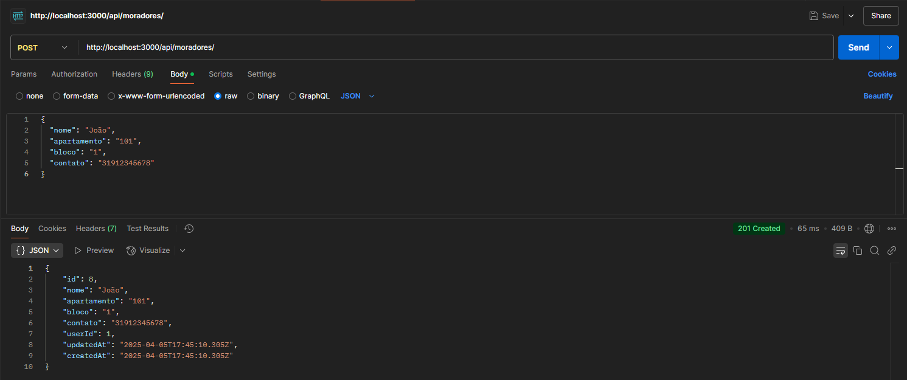

  - ❌ Criar morador com dados inválidos
    - Enviar campos faltando ou vazios.
    - **Esperado:** 400 Bad Request.
    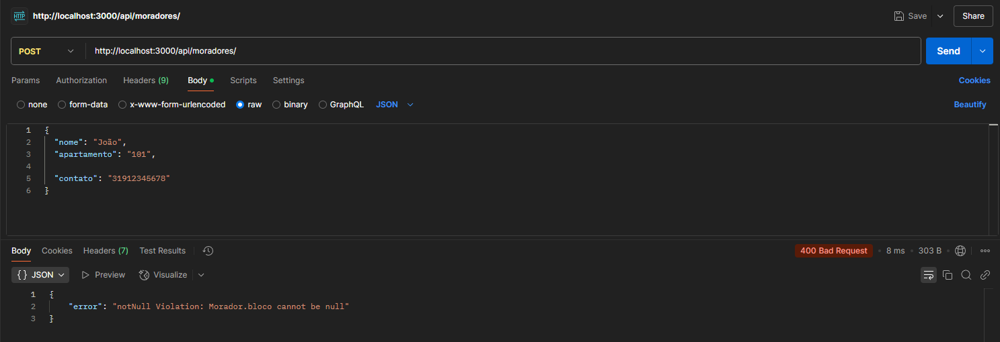

  - ❌ Criar morador sem token
    - Não enviar token na requisição.
    - **Esperado:** 401 Unauthorized.
    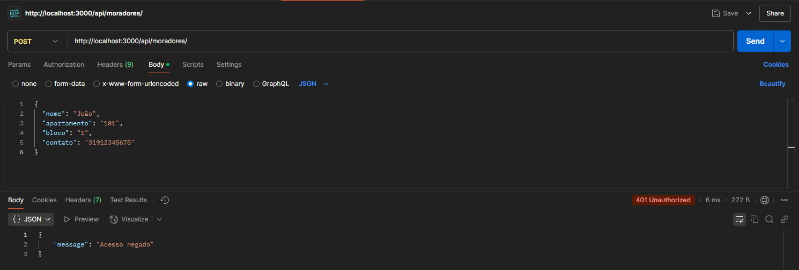

### 2. Listar Moradores
- Método: GET /api/moradores
- Testes:
  - ❌ Listar moradores sem token
    - Não enviar token.
    - **Esperado:** 401 Unauthorized.
    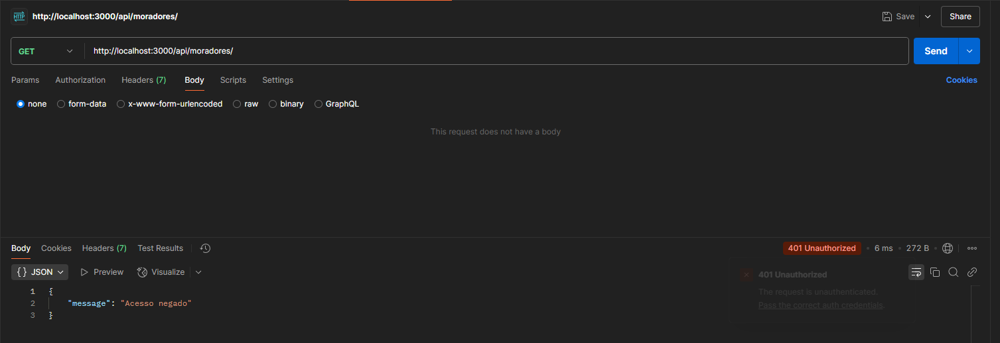

  - ✅ Listar moradores com token de admin
    - Enviar token do usuário admin.
    - **Esperado:** 200 OK com a lista de moradores.
    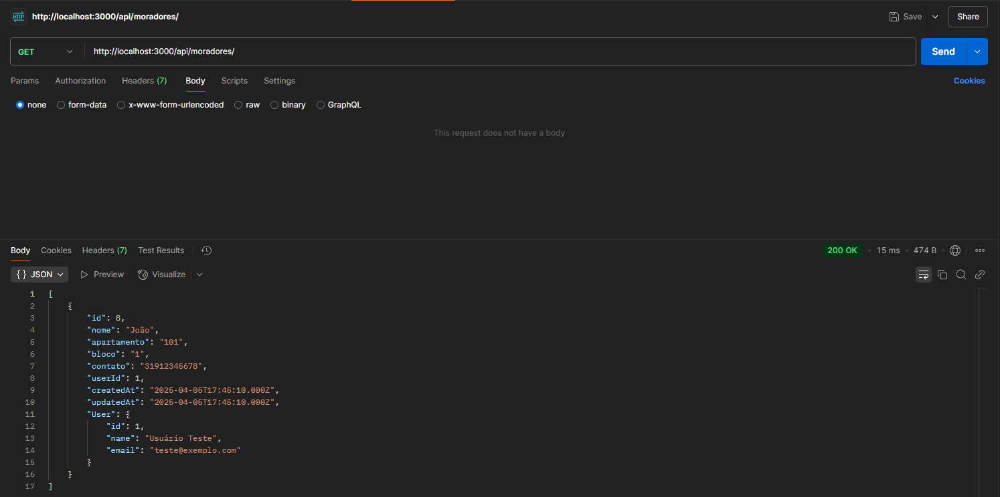

  - ❌ Listar moradores com token de usuário não admin
    - Enviar token de usuário comum.
    - **Esperado:** 403 Forbidden.
    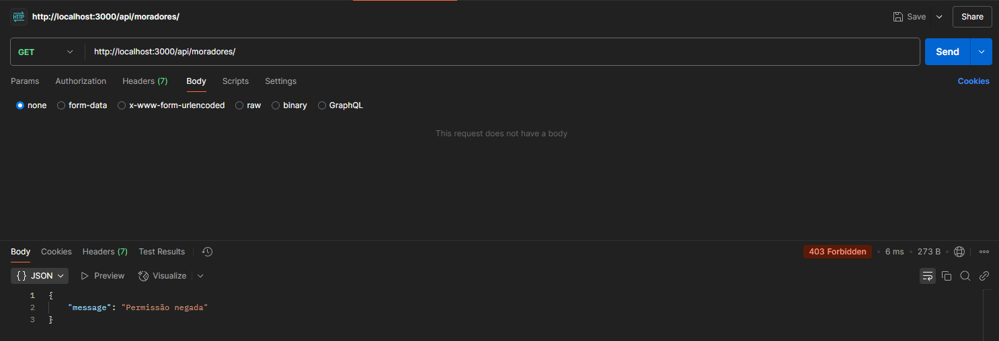

### 3. Buscar Morador por ID
- Método: GET /api/moradores/:id
- Testes:
  - ✅ Buscar morador com o mesmo ID do usuário logado
    - Token corresponde ao usuário dono do morador.
    - **Esperado:** 200 OK com retorno do morador.
    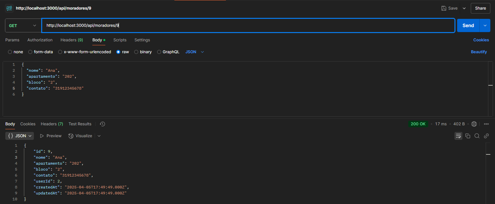

  - ❌ Buscar morador com token de outro usuário
    - Token de outro usuário sem permissão.
    - **Esperado:** 403 Forbidden.
    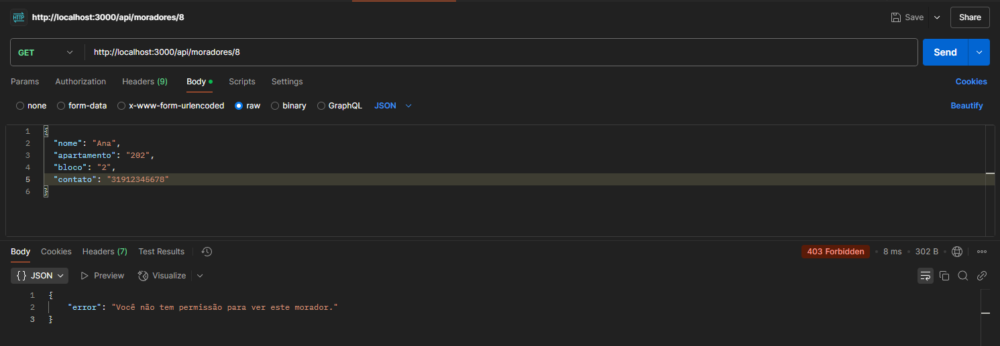

- ❌ Buscar morador por id inexistente
    - Passar um ID inválido ou que não existe.
    - **Esperado:** 404 Not Found.
    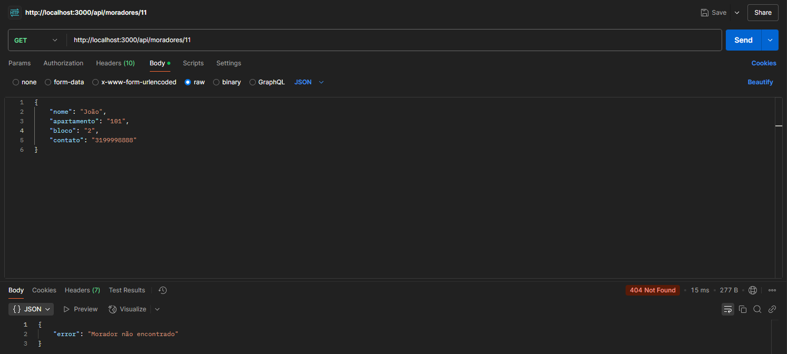

  - ✅ Buscar morador com token de admin
    - Token do usuário admin.
    - **Esperado:** 200 OK com retorno do morador.
    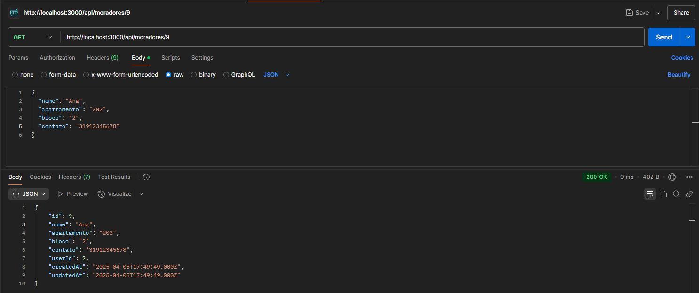

### 4. Atualizar Morador
- Método: PUT /api/moradores/:id
- Testes:
  - ✅ Atualizar morador sendo o mesmo usuário
    - Enviar token correspondente ao morador.
    - **Esperado:** 200 OK com morador atualizado.
    

  - ❌ Atualizar morador de outro usuário
    - Enviar token de usuário diferente.
    - **Esperado:** 403 Forbidden.
    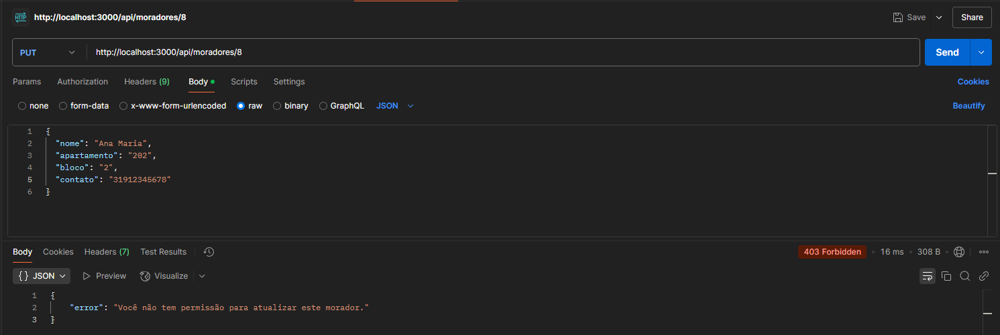

  - ❌ Atualizar morador sem token
    - Não enviar token.
    - **Esperado:** 401 Unauthorized.
    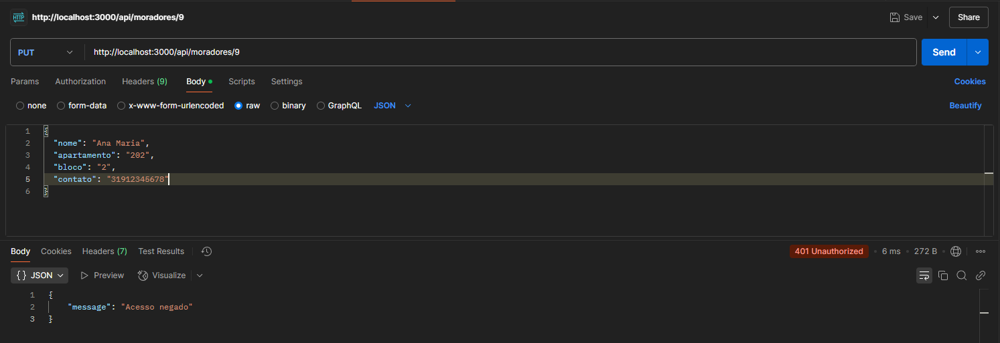

- ❌ Atualizar morador inexistente
    - Passar um ID inválido ou que não existe.
    - **Esperado:** 404 Not Found.
    

  - ✅ Atualizar morador sendo admin
    - Enviar token de usuário admin.
    - **Esperado:** 200 OK com morador atualizado.
    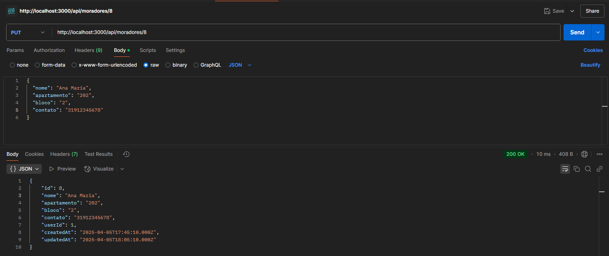

### 5. Deletar Morador
- Método: DELETE /api/moradores/:id
- Testes:
  - ❌ Deletar morador sem token
    - Não enviar token.
    - **Esperado:** 401 Unauthorized.
    

  - ❌ Deletar morador sendo usuário comum
    - Token de usuário sem permissão de admin.
    - **Esperado:** 403 Forbidden.
    

- ❌ Deletar morador inexistente
    - Passar um ID inválido ou que não existe.
    - **Esperado:** 404 Not Found.
    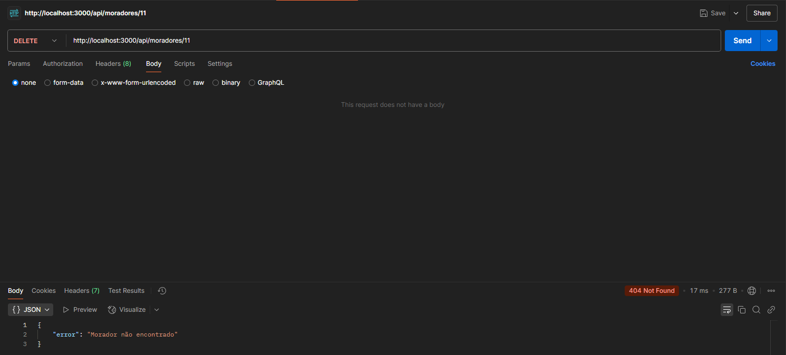

  - ✅ Deletar morador como admin
    - Enviar token de admin.
    - **Esperado:** 200 OK com mensagem de sucesso.
    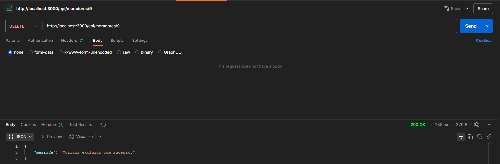

### API de Autenticação

### 1. Registrar Usuário  
  - Método: **POST** `/auth/register`  
  - Testes:

  - ✅ **Registrar novo usuário com dados válidos**
    - Enviar `name`, `email` e `password` válidos no corpo da requisição.
    - **Esperado:** 201 Created e mensagem de sucesso com o `userId`.  
    

  - ❌ **Registrar com e-mail já cadastrado**
    - Enviar um e-mail já existente no banco.
    - **Esperado:** 400 Bad Request.  
    

### 2. Login de Usuário
  - Método: **POST** `/auth/login`  
  - Testes:

  - ✅ **Login com credenciais válidas**
    - Enviar `email` e `password` corretos.
    - **Esperado:** 200 OK e retorno de um token JWT.  
    

  - ❌ **Login com senha incorreta**
    - Enviar `email` correto e `password` incorreto.
    - **Esperado:** 400 Bad Request.  
    

  - ❌ **Login com e-mail inexistente**
    - Enviar `email` não cadastrado.
    - **Esperado:** 400 Bad Request.  
    

### 3. Verificar Token
  - Método: **GET** `/auth/verify`  
  - Testes:

  - ✅ **Verificar token válido**
    - Enviar token JWT válido no header `Authorization`.
    - **Esperado:** 200 OK e resposta com o `userId`.  
    

  - ❌ **Verificar sem token**
    - Não enviar token no header.
    - **Esperado:** 401 Unauthorized.  
    

  - ❌ **Verificar com token inválido**
    - Enviar token inválido ou expirado.
    - **Esperado:** 403 Forbidden.  
    


# Referências
### Microfundamentos PUC

- Microfundamento: Gestão de Serviços de Ti
- Microfundamento: Arquitetura de Software Distribuído
- Microfundamento: Apis e Web Services
- Microfundamento: Recuperação da Informação na Web e Redes Sociais

