# Front-end Móvel

[Inclua uma breve descrição do projeto e seus objetivos.]

## Projeto da Interface
[Descreva o projeto da interface móvel da aplicação, incluindo o design visual, layout das páginas, interações do usuário e outros aspectos relevantes.]

### Wireframes

[Inclua os wireframes das páginas principais da interface, mostrando a disposição dos elementos na página.]

### Design Visual

[Descreva o estilo visual da interface, incluindo paleta de cores, tipografia, ícones e outros elementos gráficos.]

## Fluxo de Dados

[Diagrama ou descrição do fluxo de dados na aplicação.]

## Tecnologias Utilizadas

[Lista das tecnologias principais que serão utilizadas no projeto.]

## Considerações de Segurança

[Discuta as considerações de segurança relevantes para a aplicação distribuída, como autenticação, autorização, proteção contra ataques, etc.]

## Implantação

[Instruções para implantar a aplicação distribuída em um ambiente de produção.]

1. Defina os requisitos de hardware e software necessários para implantar a aplicação em um ambiente de produção.
2. Escolha uma plataforma de hospedagem adequada, como um provedor de nuvem ou um servidor dedicado.
3. Configure o ambiente de implantação, incluindo a instalação de dependências e configuração de variáveis de ambiente.
4. Faça o deploy da aplicação no ambiente escolhido, seguindo as instruções específicas da plataforma de hospedagem.
5. Realize testes para garantir que a aplicação esteja funcionando corretamente no ambiente de produção.

## Testes

[Descreva a estratégia de teste, incluindo os tipos de teste a serem realizados (unitários, integração, carga, etc.) e as ferramentas a serem utilizadas.]
### ✅ Casos de Teste - Serviço de Ocorrências (Mobile)

### 1. Listagem de Ocorrências (Usuário)
- **Objetivo:** Usuário visualiza apenas as ocorrências criadas por ele.
- **Passos:**
  1. Login como `usuário`
  2. Acessar a rota `/ocorrencias`
- **Verificações:** Lista exibe somente ocorrências do usuário logado.
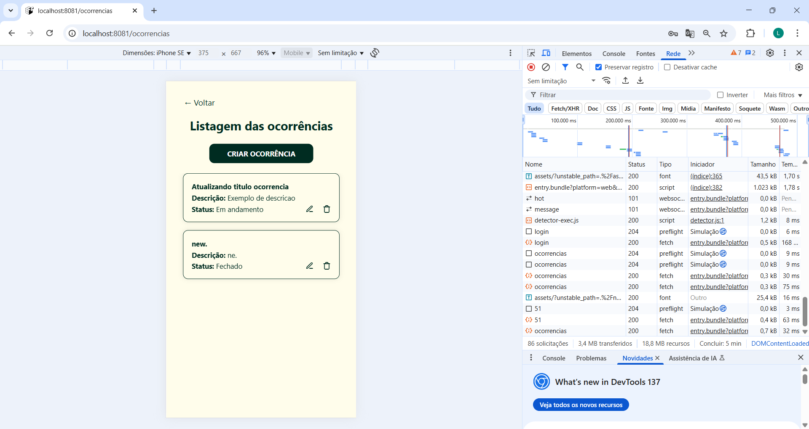
---

### 2. Visualizar Detalhes da Ocorrência (Usuário)
- **Objetivo:** Usuário deve conseguir ver os detalhes completos de uma ocorrência que criou.
- **Passos:**
  1. Login como `usuário`
  2. Acessar a rota `/ocorrencias`
  3. Clicar em "Detalhes" de uma ocorrência listada
- **Verificações:** Tela renderiza corretamente, exibe título, descrição.
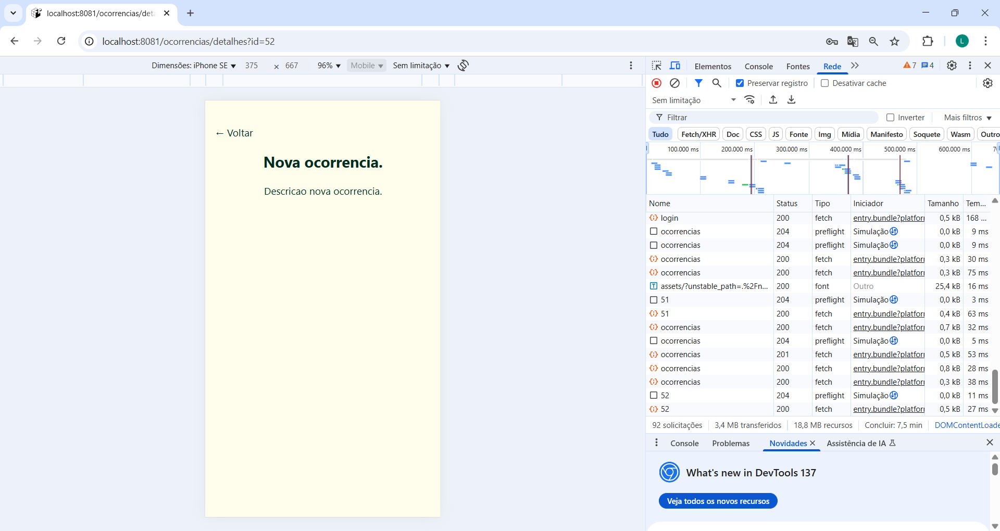
---

### 3. Criar Ocorrência
- **Objetivo:** Testar criação de nova ocorrência.
- **Passos:**
  1. Login como `usuário`
  2. Ir para `/ocorrencias/criar` clicar no botão de criar ocorrência
  3. Preencher formulário e criar
- **Verificações:** Atualiza página, toast de sucesso, nova ocorrência na lista.
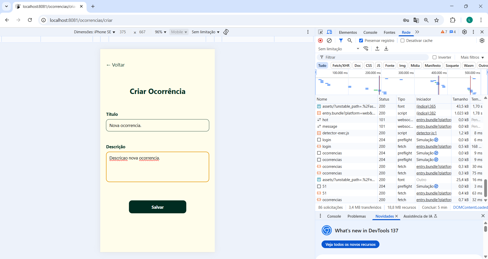
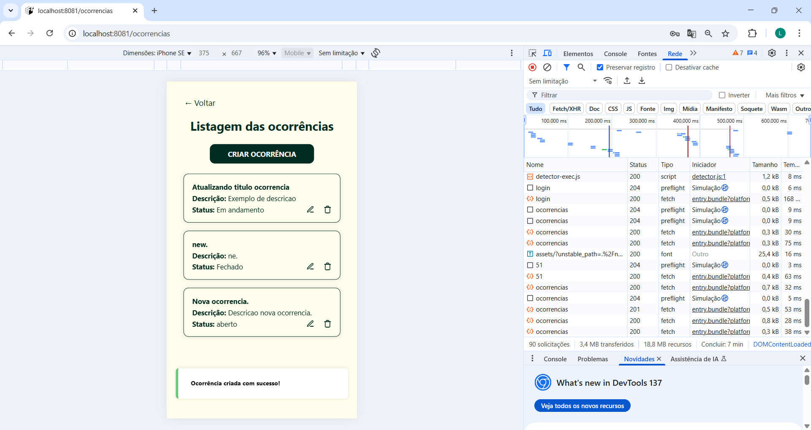
---

### 4. Editar Ocorrência
- **Objetivo:** Usuário edita ocorrência em status "aberto".
- **Passos:**
  1. Login
  2. Acessar `/ocorrencias/editar/id` clicar no icon de editar.
  3. Alterar e salvar
- **Verificações:** Dados atualizados visíveis.
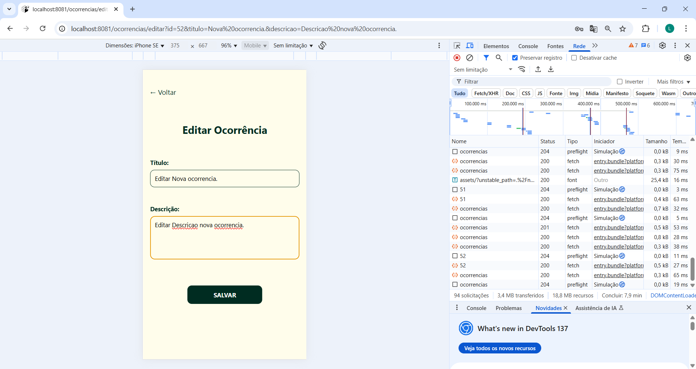
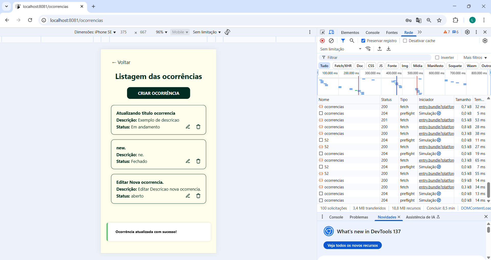
---

### 5. Excluir Ocorrência
- **Objetivo:** Usuário deleta ocorrência criada por ele.
- **Passos:**
  1. Login
  2. Clicar no icon “Excluir” e confirmar
- **Verificações:** Toast e remoção da lista.

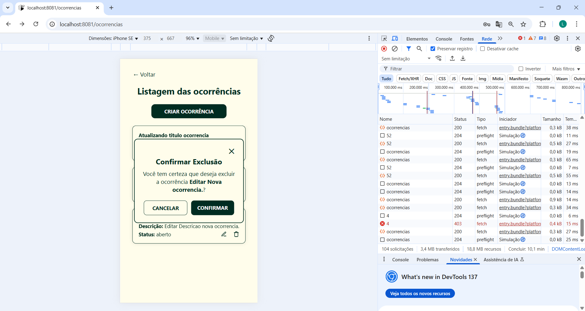
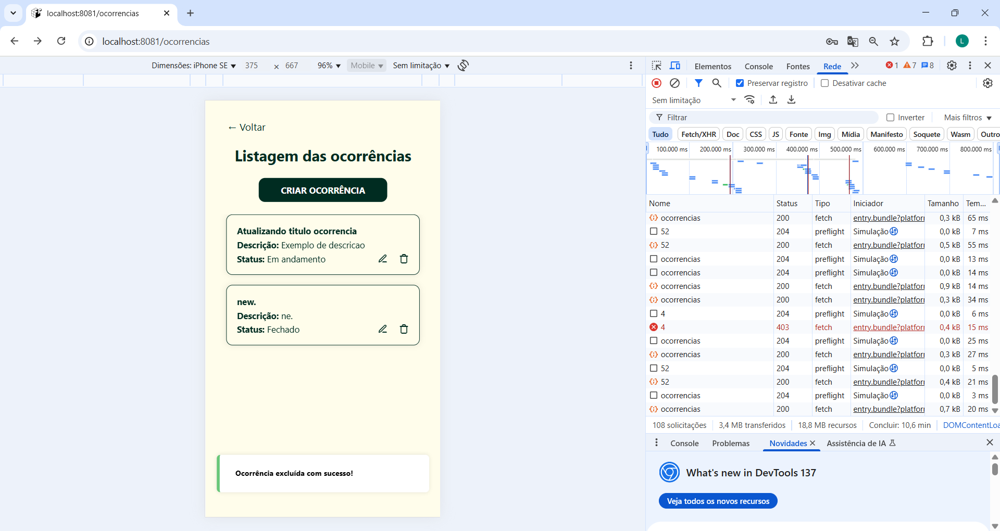
---

### 6. Tentar Editar Ocorrência com Status Não em Aberto
- **Objetivo:** Garantir que usuário não pode editar ocorrência fechada ou em andamento.
- **Passos:**
  1. Acessar `/ocorrencias/editar/id` e clicar no icon de editar em uma ocorrência com status diferente de `aberto`, alterar os campos e confirmar.
- **Verificações:** Toast com mensagem explicativa.
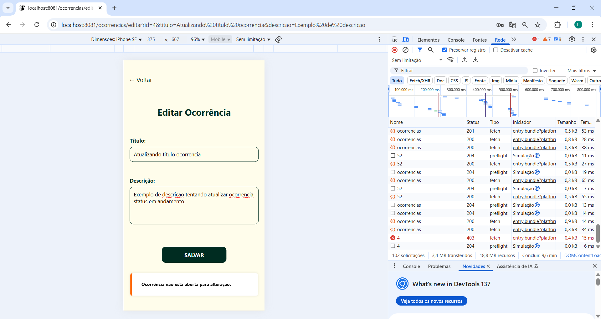
---

### 7. Criar Ocorrência com Campos Vazios
- **Objetivo:** Formulário deve validar campos obrigatórios.
- **Passos:**
  1. Login
  2. Acessar formulário e tentar enviar vazio
- **Verificações:** Campos com erro.
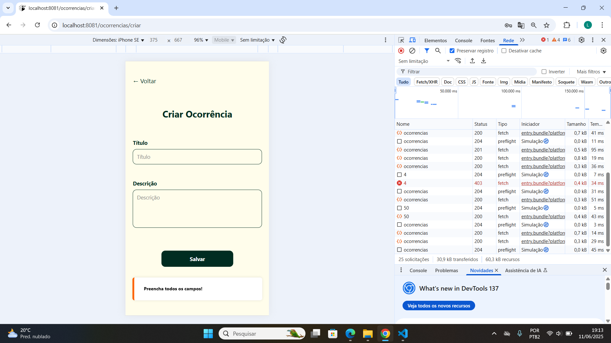
---

### 8. Listagem de Ocorrências (Admin)
- **Objetivo:** Admin visualiza todas as ocorrências cadastradas no sistema.
- **Passos:**
  1. Login como admin
  2. Acessar a rota `/ocorrenciasAdmin`
- **Verificações:** Lista mostra todas as ocorrências existentes, independente do autor.

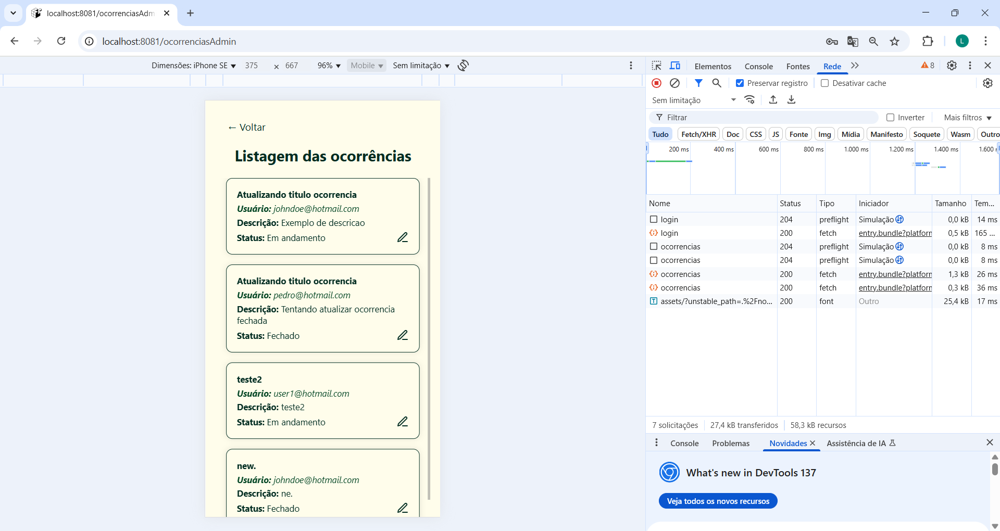
---

### 9. Visualizar Detalhes da Ocorrência (Admin)
- **Objetivo:** Admin vê detalhes completos de qualquer ocorrência.
- **Passos:**
  1. Login como admin
  2. Acessar `ocorrencias/detalhesadmin/id`
- **Verificações:** Dados visíveis corretamente.
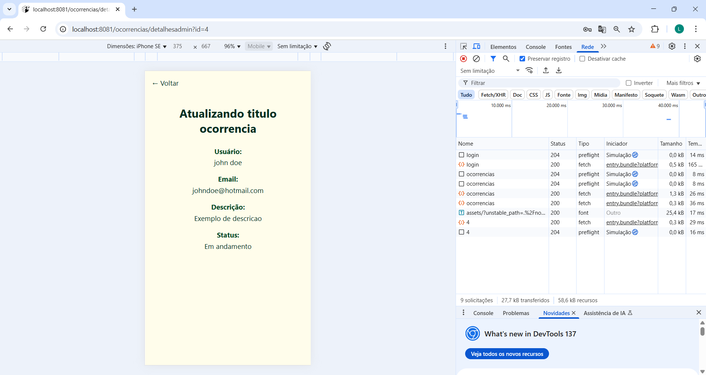
---

### 10. Editar Status da Ocorrência (Admin)
- **Objetivo:** Admin altera status de ocorrência.
- **Passos:**
  1. Login admin
  2. Clicar para alterar status
- **Verificações:** Status atualizado, mensagem de sucesso.
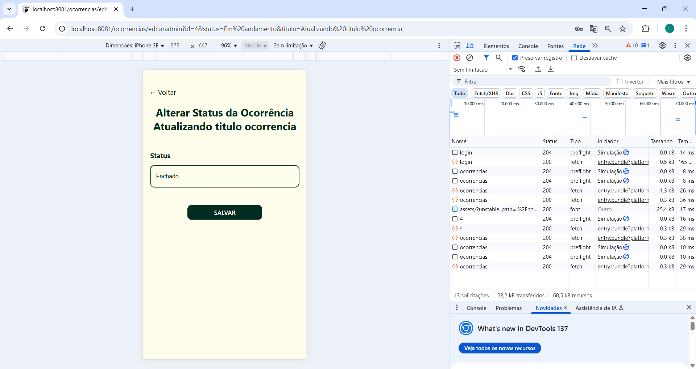
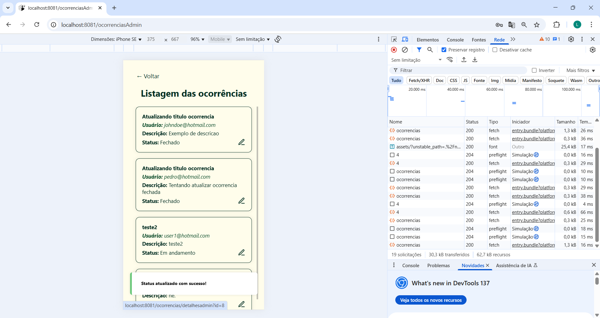

1. Crie casos de teste para cobrir todos os requisitos funcionais e não funcionais da aplicação.
2. Implemente testes unitários para testar unidades individuais de código, como funções e classes.
3. Realize testes de integração para verificar a interação correta entre os componentes da aplicação.
4. Execute testes de carga para avaliar o desempenho da aplicação sob carga significativa.
5. Utilize ferramentas de teste adequadas, como frameworks de teste e ferramentas de automação de teste, para agilizar o processo de teste.

# Referências

Inclua todas as referências (livros, artigos, sites, etc) utilizados no desenvolvimento do trabalho.
