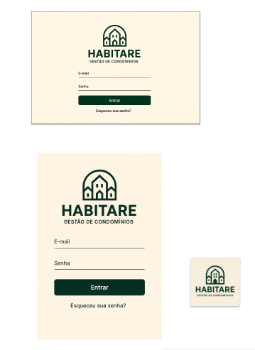
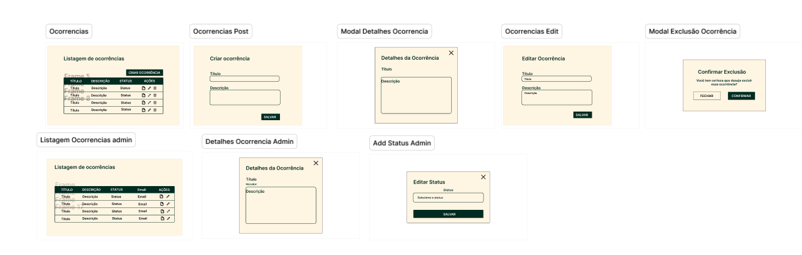
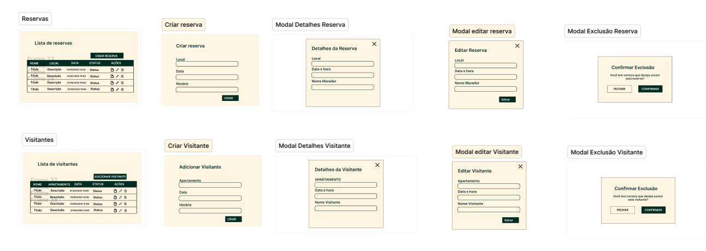
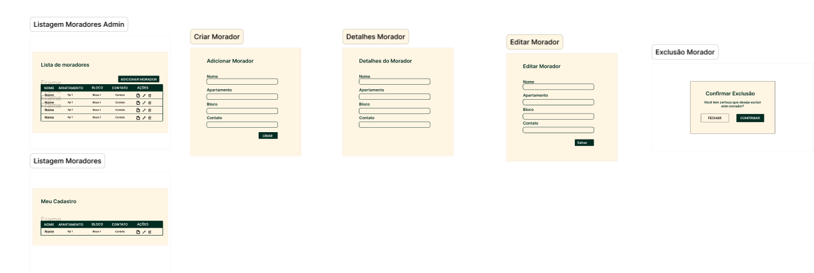

# Front-end Web

**Descrição do Projeto:**  
O **Habitare - Gestão de Condomínios** é uma aplicação web projetada para facilitar a administração e a gestão de condomínios residenciais. A interface foi desenvolvida com foco na usabilidade e clareza, oferecendo aos administradores e moradores uma maneira simples e eficiente de interagir com informações relacionadas ao condomínio, como reservas, moradores, visitantes e ocorrências.

**Objetivos do Projeto:**  
- **Facilitar a gestão de condomínios** por meio de uma interface intuitiva e de fácil navegação.
- **Proporcionar aos moradores e administradores ferramentas para o gerenciamento diário**, como cadastro de moradores, reservas de espaços e controle de visitantes.
- **Otimizar o fluxo de trabalho dos administradores**, permitindo a atualização e gestão rápida das informações sem a necessidade de redirecionamentos.
- **Garantir uma experiência responsiva e acessível**, adaptada tanto para dispositivos desktop quanto móveis.

## Projeto da Interface Web

O projeto da interface web da aplicação **Habitare - Gestão de Condomínios** apresenta uma estrutura visual clara, organizada e voltada para a administração e usabilidade em ambientes residenciais, especialmente voltados à gestão condominial. Abaixo segue a descrição detalhada da interface:

## 🖥️ Design Visual
- **Paleta de Cores:** Tons suaves de bege como fundo com elementos em verde escuro transmitem seriedade, clareza e acolhimento, ideais para aplicações de gestão residencial.
- **Tipografia:** Simples e legível, priorizando a usabilidade.
- **Ícones:** Utilizados para ações como visualizar, editar e excluir, de forma intuitiva.
- **Marca:** O logo “Habitare - Gestão de Condomínios” está presente nas telas principais e login, reforçando a identidade visual.

## 📄 Layout das Páginas

### 🔐 Tela de Login
- Campos de E-mail e Senha
- Botão de **Entrar**
- Link para **recuperação de senha**
- Versão responsiva (layout adaptado para mobile)

### 👥 Moradores
- **Listagem Admin:**  
  Tabela com colunas: Nome, Apartamento, Bloco, Contato e Ações  
  Botão **Adicionar Morador**  
  Ações: visualizar detalhes, editar e excluir

- **Meu Cadastro (Morador):**  
  Mesma tabela, mas mostra apenas o cadastro do próprio morador

- **Modais:**  
  - Criar Morador  
  - Detalhes do Morador  
  - Editar Morador  
  - Confirmação de Exclusão

### 📅 Reservas
- **Listagem:**  
  Tabela com colunas: Nome, Local, Data, Status, Ações  
  Botão **Criar Reserva**

- **Modais:**  
  - Criar reserva  
  - Detalhes da reserva  
  - Editar reserva  
  - Confirmar exclusão

### 🚪 Visitantes
- **Listagem:**  
  Tabela com colunas: Nome, Apartamento, Data, Status, Ações  
  Botão **Adicionar Visitante**

- **Modais:**  
  - Criar visitante  
  - Detalhes do visitante  
  - Editar visitante  
  - Confirmar exclusão

### 📢 Ocorrências
- **Listagem (Morador e Admin):**  
  Colunas: Título, Descrição, Status, Email, Ações

- **Modais:**  
  - Criar ocorrência  
  - Detalhes da ocorrência  
  - Editar ocorrência  
  - Excluir ocorrência  
  - Admin: Modal extra para editar status

## 🔁 Interações do Usuário
- **CRUD Completo** (Criar, Ler, Atualizar, Excluir) para moradores, reservas, visitantes e ocorrências.
- Modais flutuantes que evitam o redirecionamento de página, promovendo agilidade.
- Botões de ação visualmente destacados.
- Uso de ícones universais (lápis, olho, lixeira) facilita a compreensão sem depender de texto.

### Wireframes

### Design Visual

# Estilo Visual da Interface

A interface da aplicação **Habitare - Gestão de Condomínios** foi projetada com foco na clareza, simplicidade e facilidade de uso. O estilo visual é pensado para transmitir seriedade, acolhimento e eficiência na gestão condominial. Abaixo, detalho os principais aspectos do design visual.

## 🎨 Paleta de Cores
A paleta de cores foi escolhida para proporcionar um ambiente visual calmo e profissional, com destaque para a clareza e a acessibilidade.

- **Fundo:** Tons suaves de bege ou cinza claro para criar um ambiente tranquilo e limpo.
- **Elementos principais:** Verde escuro para elementos de destaque, como botões e links, trazendo uma sensação de seriedade e confiança.
- **Textos:** Tons de cinza escuro para garantir boa legibilidade e contraste com o fundo claro.

## 🅰️ Tipografia
A tipografia foi escolhida para priorizar a legibilidade e facilitar a leitura rápida das informações.

- **Fonte primária:** Uma fonte sans-serif limpa e moderna, com espaçamento adequado entre letras e linhas.
- **Cabeçalhos e títulos:** Fonte em negrito para garantir destaque e fácil identificação das seções.
- **Texto do corpo:** Fonte regular com bom contraste e tamanho de letra confortável para leitura prolongada.

## 🖼️ Ícones
Os ícones são usados de forma estratégica para representar ações comuns, como editar, excluir ou visualizar informações, tornando a interface intuitiva e fácil de navegar.

- **Ícones de ação:** Ícones simples e universais como o lápis para edição, o olho para visualização e a lixeira para exclusão.
- **Ícones de status:** Ícones coloridos para indicar o status de itens, como verde para "ativo" e vermelho para "inativo", ajudando o usuário a identificar rapidamente o estado das informações.

## 🧩 Outros Elementos Gráficos
A interface utiliza outros elementos gráficos de maneira sutil para garantir a clareza e fluidez da navegação.

- **Botões:** Os botões são destacados com cores fortes (como verde escuro) e possuem bordas arredondadas para um visual moderno. Ao passar o mouse sobre eles, há um efeito de hover que muda ligeiramente a cor, indicando que são interativos.
- **Modais:** As janelas modais possuem bordas suaves e um fundo translúcido para dar destaque ao conteúdo e criar uma sensação de profundidade.
- **Barras de navegação:** A barra superior tem um fundo em verde escuro com o logo do sistema, enquanto a navegação lateral (quando presente) é discreta, com ícones e texto, para facilitar a navegação entre as seções.

## 🖋️ Marca
- **Logo:** O logo “Habitare - Gestão de Condomínios” está presente nas telas principais e na tela de login, reforçando a identidade visual da aplicação. O design do logo é simples e direto, refletindo a seriedade e a funcionalidade da plataforma.

## Fluxo de Dados

[Diagrama ou descrição do fluxo de dados na aplicação.]

## Tecnologias Utilizadas

- **Node.js**: Plataforma para execução do JavaScript no servidor, oferecendo alta performance e grande ecossistema de bibliotecas.
- **Express.js**: Framework web minimalista para Node.js, ideal para criação de APIs RESTful.
- **JWT (JSON Web Token)**: Para autenticação segura baseada em tokens.
- **Sequelize ORM**: Para abstração e manipulação de bancos de dados relacionais com JavaScript.
- **RESTful API**: Arquitetura de API baseada em recursos e métodos HTTP (GET, POST, PUT, DELETE).
- **MySQL**: Banco de dados relacional utilizado para armazenar de forma estruturada os dados manipulados pela API.

## Considerações de Segurança

## 🔐 Autenticação
A autenticação garante que apenas usuários autorizados possam acessar a aplicação. Para isso, as seguintes práticas devem ser adotadas:

- **Autenticação baseada em token (JWT):** Utilizar tokens JWT para gerenciar sessões de usuários de forma segura, evitando problemas com sessões compartilhadas ou vazadas.
- **Senhas fortes e criptografadas:** Exigir senhas complexas e garantir que todas as senhas sejam armazenadas de maneira segura utilizando algoritmos de hash (por exemplo, bcrypt).
- **Controle de sessão:** Garantir que as sessões tenham expiração automática após um período de inatividade e possibilitar o logout remoto.

## 🔑 Autorização
A autorização garante que um usuário tenha acesso apenas às funcionalidades e dados que ele tem permissão para visualizar ou modificar.

- **Controle de Acesso baseado em Funções (RBAC):** Definir permissões baseadas em papéis (como morador e administrador) para garantir que os usuários só possam acessar ou modificar as informações relevantes para seu papel.
- **Acesso a recursos sensíveis:** Implementar verificações rigorosas para ações que envolvem dados sensíveis, como a exclusão de moradores ou alterações nas reservas. Apenas administradores devem poder executar essas ações.
- **Segregação de responsabilidades:** Garantir que diferentes perfis de usuário (administradores e moradores) tenham visibilidade e controle diferentes sobre as informações. Por exemplo, moradores só podem acessar e editar seus próprios dados, enquanto administradores podem acessar e modificar dados de todos.

## Implantação

Implantação ainda não realizada.

## Testes

### ✅ Casos de Teste - Serviço de Ocorrências 

### 1. Visualizar Detalhes da Ocorrência (Usuário)
- **Objetivo:** Usuário deve conseguir ver os detalhes completos de uma ocorrência que criou.
- **Passos:**
  1. Login como `usuário`
  2. Acessar a rota `/ocorrencias`
  3. Clicar em "Detalhes" de uma ocorrência listada
- **Verificações:** Modal renderiza corretamente, exibe título, descrição.

### 2. Criar Ocorrência
- **Objetivo:** Testar criação de nova ocorrência.
- **Passos:**
  1. Login como `usuário`
  2. Ir para `/ocorrencias` clicar no botão de criar ocorrência
  3. Preencher formulário e criar
- **Verificações:** Atualiza página, toast de sucesso, nova ocorrência na lista.

### 3. Editar Ocorrência
- **Objetivo:** Usuário edita ocorrência em status "aberto".
- **Passos:**
  1. Login
  2. Acessar `/ocorrencias` clicar no icon de editar.
  3. Alterar e salvar
- **Verificações:** Dados atualizados visíveis.

### 4. Excluir Ocorrência
- **Objetivo:** Usuário deleta ocorrência criada por ele.
- **Passos:**
  1. Login
  2. Clicar no icon “Excluir” e confirmar
- **Verificações:** Toast e remoção da lista.

### 5. Tentar Editar Ocorrência com Status Não em Aberto
- **Objetivo:** Garantir que usuário não pode editar ocorrência fechada ou em andamento.
- **Passos:**
  1. Acessar `/ocorrencias` e clicar no icon de editar em uma ocorrência com status diferente de `aberto`
- **Verificações:** Toast com mensagem explicativa.

### 6. Criar Ocorrência com Campos Vazios
- **Objetivo:** Formulário deve validar campos obrigatórios.
- **Passos:**
  1. Login
  2. Acessar formulário e tentar enviar vazio
- **Verificações:** Campos com erro.

### 7. Usuário Tentando Editar Ocorrência com Status Alterado no Momento por Admin
- **Objetivo:** Simular conflito de edição entre usuário e admin.
- **Passos:**
  1. Usuário tenta editar enquanto admin muda status
- **Verificações:** Toast de erro.

### 8. Visualizar Detalhes da Ocorrência (Admin)
- **Objetivo:** Admin vê detalhes completos de qualquer ocorrência.
- **Passos:**
  1. Login como admin
  2. Acessar `/admin/ocorrencias`
- **Verificações:** Dados visíveis corretamente.

### 9. Editar Status da Ocorrência (Admin)
- **Objetivo:** Admin altera status de ocorrência.
- **Passos:**
  1. Login admin
  2. Clicar para alterar status na tabela
- **Verificações:** Status atualizado, mensagem de sucesso.

### 10. Admin Tentando Modificar Status de Ocorrência que foi Excluída
- **Objetivo:** Admin tenta mudar status de ocorrência removida.
- **Passos:**
  1. Login como admin
  2. Acessar tela de listagem, tentar mudar status e ao confirmar receber uma mensagem informativa.
- **Verificações:** Exibe mensagem “ocorrência não encontrada”.

### 11. Acessar Rotas sem Token (Usuário/Admin)
- **Objetivo:** Verificar que rotas protegidas bloqueiam acesso sem autenticação.
- **Passos:**
  1. Acessar rotas como `/ocorrencias`, `/admin/ocorrencias` sem estar logado
- **Verificações:** Usuário recebe tela sem dados e toast informativo.
  
# ✅ Casos de Teste – Tela de Reservas

## 🧪 1. Carregamento inicial
- **Descrição**: Verificar se os dados são carregados corretamente ao abrir a tela.
- **Pré-condição**: Usuário autenticado com token válido no `localStorage`.
- **Resultado esperado**: A tabela é renderizada com os dados das reservas vindos da API.

## 🧪 2. Verificação de URL correta
- **Descrição**: Verificar se a rota `/reservas` está presente na URL ao acessar a tela.
- **Pré-condição**: Navegação para a tela de reservas.
- **Resultado esperado**: A URL deve conter `/reservas`.

## 🧪 3. Verificação de permissão de admin
- **Descrição**: Verificar se o botão "CRIAR RESERVA" é exibido apenas para usuários não-admin.
- **Pré-condição**: Token com `id === 1` (admin) ou diferente de 1 (usuário comum).
- **Resultado esperado**: 
  - Se admin: botão **não** é exibido.  
  - Se usuário comum: botão **é** exibido.

## 🧪 4. Abertura do modal de criação
- **Descrição**: Verificar se o modal de criação de reserva abre ao clicar no botão "CRIAR RESERVA".
- **Pré-condição**: Usuário não-admin.
- **Resultado esperado**: ModalCriacaoReservas abre corretamente.

## 🧪 5. Criação de nova reserva
- **Descrição**: Criar uma nova reserva via modal e verificar se ela aparece na tabela.
- **Ações**: Preencher `nome`, `data` e `horário` e clicar em "Criar".
- **Resultado esperado**: 
  - Reserva criada com sucesso (chamada `createReserva`)  
  - Modal fecha  
  - Nova reserva aparece na lista
  
## 🧪 6. Abertura do modal de detalhes
- **Descrição**: Ao clicar no ícone de **informações (FaInfoCircle)**, o modal de detalhes deve abrir.
- **Resultado esperado**: ModalDetalhes mostra o `nome`, `data` e `horário` da reserva selecionada.

## 🧪 7. Edição de reserva ativa
- **Descrição**: Clicar no botão de editar (ícone FaEdit) em uma reserva com status **Ativo**.
- **Resultado esperado**: 
  - Modal de edição (`ModalEdicaoReservas`) é aberto  
  - Campos preenchidos com os dados da reserva  
  - Após edição, os dados são atualizados na tabela

## 🧪 8. Tentativa de edição de reserva inativa
- **Descrição**: Clicar em editar uma reserva **não ativa**.
- **Resultado esperado**: 
  - Modal **não** é aberto  
  - Toast de aviso exibido: _"Não é possível editar uma reserva que não está com status ativo."_

## 🧪 9. Cancelamento de reserva
- **Descrição**: Clicar no ícone de cancelar (`FaTimes`) e confirmar no modal.
- **Resultado esperado**: 
  - Modal de confirmação é aberto  
  - Após confirmação, `status` da reserva na tabela muda para `cancelado`

## 🧪 10. Fechamento dos modais
- **Descrição**: Verificar se os modais fecham corretamente ao clicar no botão de fechar (`onClose`).
- **Resultado esperado**: Todos os modais devem ser fechados corretamente sem erro.

## 🧪 11. Toasts e feedbacks visuais
- **Descrição**: Verificar se os `toasts` aparecem com estilos personalizados ao executar ações como erro, aviso, etc.
- **Resultado esperado**: 
  - Toast visível com fonte 18px e largura de 400px  
  - Posicionado no canto inferior direito

# Referências

Inclua todas as referências (livros, artigos, sites, etc) utilizados no desenvolvimento do trabalho.
